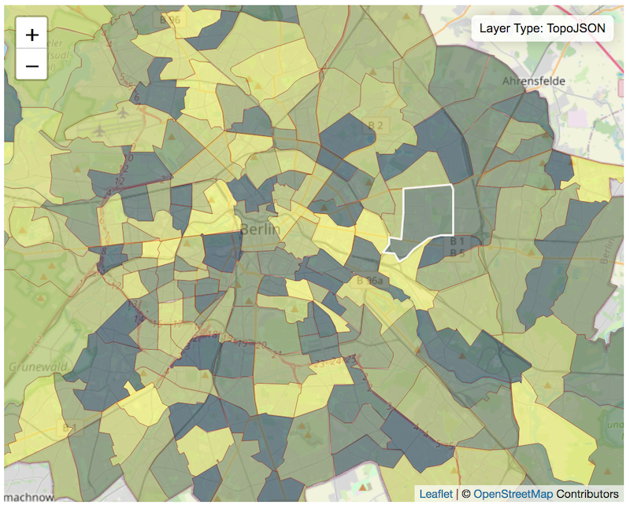

# Map Preview

Preview map layer files in your web browser using [Sublime Text 3](https://www.sublimetext.com/).



## Features

  - Interactive Map preview powered by [LeafletJS](https://leafletjs.com/)

## Supported Formats

  - [GeoJSON](https://geojson.org/)

    Currently support the following types:
    - [Features](https://tools.ietf.org/html/rfc7946#section-3.2)
    - [FeatureCollections](https://tools.ietf.org/html/rfc7946#section-3.3)

  - [TopoJSON](https://github.com/topojson/topojson/wiki)

## Installation

~Install MapPreview via [Package Control](https://packagecontrol.io/search/MapPreview)~

- ~Open Package Control: **Preferences > Package Control**~
- ~Select **Package Control: Install Package**~
- ~Type **MapPreview** into the search box and select the package to install it.~

### Manual Install (To be removed once package control is working)
- Clone the **MapPreview** repo into the Sublime Text packages location: 

```bash
# move to default Mac location
$ cd ~/Libary/Application Support/Sublime Text 3/Packages
# clone directly into the pakcages directory
$ git clone git@github.com:doneill/MapPreview.git

```

## Preview Map in Browser

With an open valid GeoJSON or TopoJSON file in Sublime Text 3:

- Right click and select **Map Preview > Preview in Browser**
- Select **Map Preview: Preview in Browser** from the command palette.

## Troubleshooting

- If your files are being alerted as not valid, please try to load with another source, e.g. [geojson.io](https://geojson.io) to confirm. If you feel like your json file is valid and should be shown please create an [issue](https://github.com/doneill/st3-map-preview/issues) for us to take a look.

## Contributors
<a href="https://github.com/doneill/st3-map-preview/graphs/contributors">
  
</a>

## Licensing
A copy of the license is available in the repository's [LICENSE](LICENSE) file.